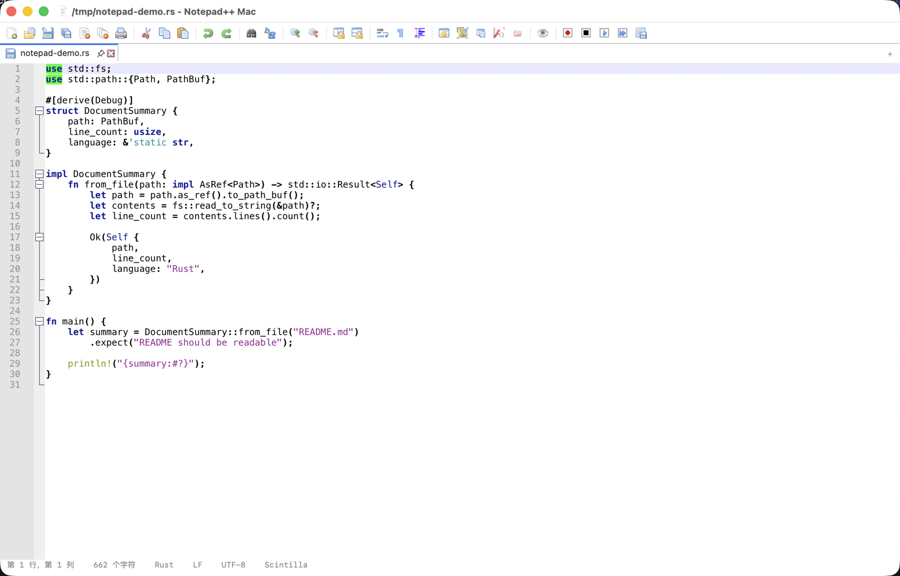
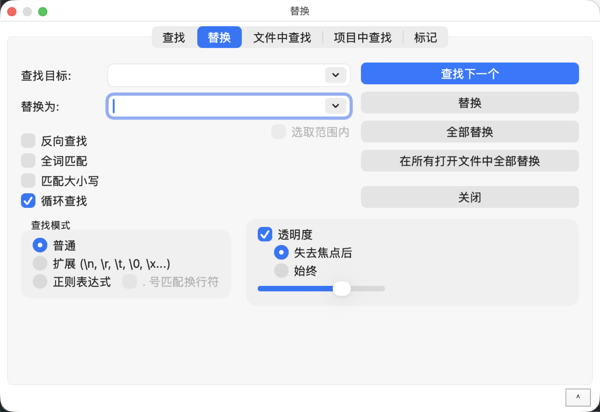
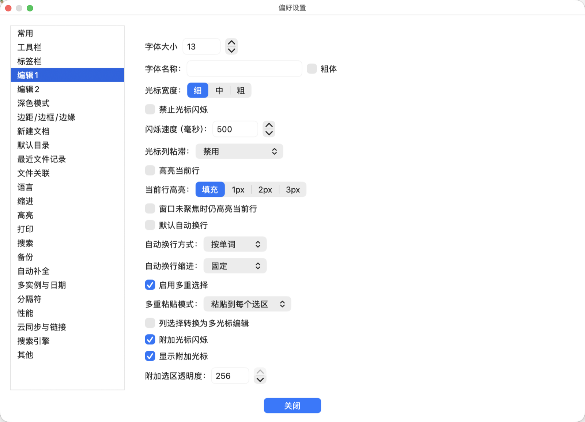
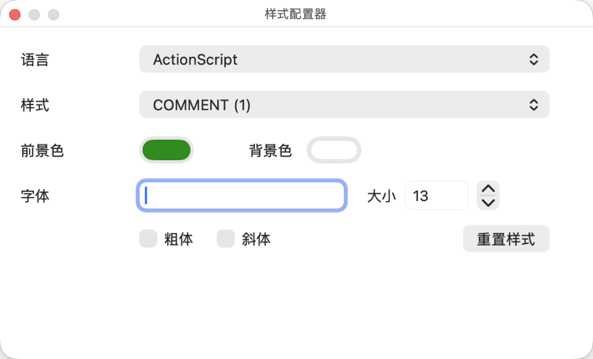
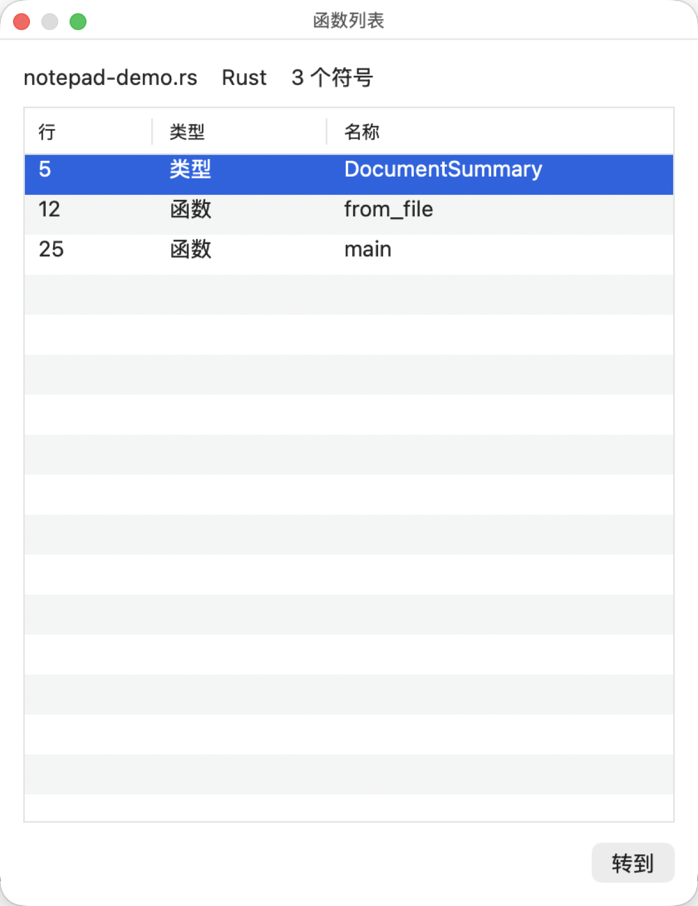

[English](README.md) | [中文](README_zh.md)

# Notepad++ Mac Native

[](LICENSE)
[](https://www.apple.com/macos)
[](https://www.swift.org/)
[](https://notepad-plus-plus.org/)

**Notepad++ Mac Native** is a free and open-source code editor and Notepad
replacement for **macOS**, built natively with Swift / AppKit. It is **not**
a Wine wrapper — the Win32 GUI layer of Notepad++ is rewritten in native
macOS code, while platform-neutral upstream resources (language models, themes,
API tables, icons) and the upstream Scintilla / Lexilla editors are reused
directly.

This is an independent macOS implementation of Notepad++. It is **not** the
official Notepad++ project and is not affiliated with or endorsed by Don HO or
the Notepad++ team. The official Windows project lives at
<https://github.com/notepad-plus-plus/notepad-plus-plus>.

## Product Screenshots

| Editor | Find and Replace |
|---|---|
|  |  |

| Preferences | Style Configurator |
|---|---|
|  |  |

| Function List |
|---|
|  |

## Relationship to Upstream Notepad++

The original Notepad++ source is preserved under `upstream/notepad-plus-plus/`
(for local development and build reference; it is `.gitignore`d and re-cloned at
a pinned commit by CI). Reusable Notepad++ data is consumed directly where it is
platform-neutral. macOS-specific UI and application lifecycle code is rewritten
with AppKit because the original `PowerEditor` application is a Win32 GUI
program. Scintilla has Cocoa code, but Notepad++'s main windowing, dialogs, menu
commands, registry integration, and plugin host are Windows-specific.

Feature-parity progress against upstream Notepad++ is tracked in
[PARITY_PLAN.md](PARITY_PLAN.md).

## License

This project is distributed under the **GNU General Public License v3.0**
([LICENSE](LICENSE)), inherited from Notepad++, of which it is a derivative work.

Like Notepad++, it is free software: you can redistribute it and/or modify it
under the terms of the GPL-3.0, and it comes with **NO WARRANTY**. See the
[GNU GPL v3](https://www.gnu.org/licenses/gpl-3.0.html) for details.

The project copyright notice and the derivative-work attribution (Notepad++,
Scintilla, Lexilla, Boost.Regex) live in [NOTICE](NOTICE).

### Third-party components

The packaged application bundles several third-party components, each under its
own license. Their copyright and license notices are reproduced in the
[THIRD_PARTY_LICENSES.md](THIRD_PARTY_LICENSES.md) file and summarized here:

| Component | Source | License |
|---|---|---|
| **Notepad++** (language models, themes, API/functionList XML, icons, boostregex bridge) | [`upstream/notepad-plus-plus`](https://github.com/notepad-plus-plus/notepad-plus-plus) — © Don HO | [GPL-3.0](https://www.gnu.org/licenses/gpl-3.0.html) |
| **Scintilla** (Cocoa editing framework) | [`scintilla`](https://www.scintilla.org/) — © Neil Hodgson | Historical Permission Notice and Disclaimer (HPND-like) |
| **Lexilla** (lexer library) | [`lexilla`](https://www.scintilla.org/Lexilla.html) — © Neil Hodgson | Historical Permission Notice and Disclaimer (HPND-like) |
| **Boost.Regex** (regex engine, via boostregex bridge) | [boost.org](https://www.boost.org/) | [Boost Software License 1.0](https://www.boost.org/LICENSE_1_0.txt) |

All bundled assets (Notepad++ `langs.model.xml`, `stylers.model.xml`, API XML,
function-list XML, theme XML, the chameleon icon) are GPL-3.0 material from the
upstream project and are redistributed under the same terms.

### Trademarks

"Notepad++" and the Notepad++ name and logo are trademarks of their respective
owners, used here only to identify the upstream project this editor is derived
from. This project is an independent derivative and does not imply endorsement
by the Notepad++ trademark holders.

## Build and Test

```bash
swift test
swift build
```

## Package

```bash
scripts/package-macos.sh
```

The packaging script creates:

- `dist/Notepad++ Mac.app`
- `dist/Notepad++ Mac.dmg`

After packaging, run `scripts/smoke-packaged-app.sh` to launch the app with a
temporary Rust file and verify that the packaged app loads the bundled
Scintilla and Lexilla runtimes, rather than a development-tree or system copy.

For static package validation before smoke testing, run
`scripts/verify-package.sh` to check the app bundle, bundled runtimes, signing,
DMG checksum, and quarantine attributes. The verify and smoke scripts provide
evidence that the packaged app is using the bundled Scintilla framework and
Lexilla dylib.

The script attempts to package the main `NotepadMac` executable as universal
`arm64` + `x86_64`. It first uses SwiftPM's one-step architecture support when
the installed toolchain exposes it; otherwise it builds separate arm64 and
x86_64 release binaries and merges them with `lipo`. If that is not possible,
the script falls back to the native Swift release build and prints the detected
architecture. It attempts to build the bundled Scintilla Cocoa framework as
`arm64` + `x86_64` by default, then falls back to Xcode's default architecture
selection if that framework build is not available. It also prints the packaged
Scintilla and Lexilla architectures, because a universal main executable does
not make the full app bundle universal when a bundled framework or dylib is
still single-architecture. Set `MACOS_SCINTILLA_ARCHS`,
`MACOS_SCINTILLA_ONLY_ACTIVE_ARCH`, `MACOS_SCINTILLA_DESTINATION`,
`MACOS_SCINTILLA_CONFIGURATION`, or `MACOS_SCINTILLA_DERIVED_DATA` to override
the Scintilla Xcode build inputs and packaged framework path.

Lexilla packaging is explicit and verified, not relying on the upstream
makefile's default macOS flags. By default `scripts/package-macos.sh`
requests a universal `liblexilla.dylib` build with `arm64 x86_64`, verifies
that the built dylib contains both requested slices, and falls back to the
active architecture only when the universal request fails. To control that
build directly, use `MACOS_LEXILLA_ARCHS`, `MACOS_LEXILLA_ONLY_ACTIVE_ARCH`,
or `MACOS_LEXILLA_UNIVERSAL_ARCHS`; the lower-level
`scripts/build-lexilla-dylib.sh` script also accepts
`MACOS_LEXILLA_EXTRA_BASE_FLAGS` and `MACOS_LEXILLA_EXTRA_LDFLAGS` for
toolchain-specific overrides, plus `MACOS_LEXILLA_JOBS` when local memory
pressure requires a lower make parallelism. The Lexilla install name defaults
to `@rpath/liblexilla.dylib` and can be overridden with
`MACOS_LEXILLA_INSTALL_NAME`; packaging rewrites the copied dylib to that
bundle-safe install name before signing. The final package report prints the
Lexilla build mode, requested architectures, and actual packaged slices.

By default the app bundle and DMG are ad hoc signed for local development. Some
managed or stricter macOS installations reject ad hoc GUI apps at launch. For a
build meant to run through Gatekeeper without local overrides, provide a real
signing identity:

```bash
MACOS_CODESIGN_IDENTITY="Developer ID Application: Example Team" \
scripts/package-macos.sh
```

If the identity lives outside the default keychain search list, also set
`MACOS_CODESIGN_KEYCHAIN=/path/to/keychain`. Distribution still requires the
usual Apple notarization flow after packaging.

## Reusable Upstream Components

Already wired into the native app:

- `../notepad-plus-plus/PowerEditor/src/langs.model.xml`
  - packaged into `Contents/Resources/langs.model.xml`
  - parsed at runtime for language detection, comment markers, and keyword data
- `../notepad-plus-plus/PowerEditor/src/stylers.model.xml`
  - packaged into `Contents/Resources/stylers.model.xml`
  - parsed at runtime for lexer style IDs, colors, fonts, and keyword classes
- `../notepad-plus-plus/PowerEditor/installer/APIs`
  - packaged into `Contents/Resources/APIs`
  - parsed at runtime for language-specific auto-completion keywords,
    function markers, overload descriptions, and parameter lists
- `../notepad-plus-plus/PowerEditor/installer/functionList`
  - packaged into `Contents/Resources/functionList`
  - parsed at runtime for function-list parser metadata; native macOS symbol
    extraction uses compatible regex rules for supported languages
- `../notepad-plus-plus/PowerEditor/installer/themes`
  - packaged into `Contents/Resources/themes`
  - scanned at runtime for Notepad++ theme XML files and loaded through the
    same style parser used by `stylers.model.xml`
- `../notepad-plus-plus/PowerEditor/misc/chameleon/chameleon-pencil-1000.png`
  - converted into the macOS app icon

Also built and packaged:

- `../notepad-plus-plus/scintilla/cocoa/Scintilla/Scintilla.xcodeproj`
  - build with `scripts/build-scintilla-framework.sh`
  - output: `.build/scintilla-derived/Build/Products/Release/Scintilla.framework`
  - packaged into `Contents/Frameworks/Scintilla.framework`
  - loaded at runtime by the native editor surface; if loading fails, the app
    falls back to `NSTextView`
- `../notepad-plus-plus/lexilla`
  - build with `scripts/build-lexilla-dylib.sh`
  - output: `../notepad-plus-plus/lexilla/bin/liblexilla.dylib`
  - packaged into `Contents/Frameworks/liblexilla.dylib`
  - build requests are arch-aware and validated against the produced dylib
  - packaged install name is rewritten to `@rpath/liblexilla.dylib`
  - loaded at runtime to create Lexilla `ILexer5` instances for Scintilla

## Current Native Features

- Native AppKit window and menu bar
- New, open, save, and save-as
- Native Preferences panel backed by macOS `UserDefaults`
- Native find and replace panel with match-case, whole-word, direction, and
  wrap-around options; Search menu includes Find Previous (Cmd+Shift+G)
- Native session restore for file-backed documents
- Native dirty-buffer snapshot restore using app-managed backup files
- Native Workspace panel for Notepad++ project XML and folder trees
- Native AppKit document tabs with duplicate-file activation
- Native editor toolbar with Save, Print, Find, Replace, bookmark, line-wrap,
  function-list, and optional folding commands
- Native Style Configurator panel backed by Notepad++ `stylers.model.xml`
- Native file monitoring for saved documents with reload/keep-current prompts
- Native print operation for the current document with headers and line numbers
- Native macro recording and replay for text-edit commands, including saved
  named macros
- Native Plugin Admin panel for manifest-based macOS plugin discovery and
  compatibility diagnostics for Windows Notepad++ DLL plugins, with native
  command execution, persisted enable/disable controls for native manifest
  plugins, install/update from an existing native plugin folder, bounded removal
  of user-installed native manifest plugins, explicit rescan, a user plugin
  folder opener, and streamed stdout/stderr in the panel
- Native Auto Completion panel backed by Notepad++ `installer/APIs/*.xml`
- Native Function Call Tip panel backed by Notepad++ API overload metadata
- Native Function List panel backed by Notepad++ `installer/functionList/*.xml`
  metadata and native symbol extraction
- Native Document Statistics command showing line count, word count, UTF-16
  characters, and Unicode scalar counts for the current buffer
- Native Theme menu backed by Notepad++ `installer/themes/*.xml`, with
  persisted theme selection and live restyling of open editor windows
- Native bookmark commands for toggling the current line, navigating previous
  and next bookmarks with wraparound, clearing bookmarks, and showing bookmark
  count in the status line, with bookmark restoration for reopened session
  files and dirty snapshot drafts
- Native line editing commands for deleting the current line or selected line
  range, joining lines, removing empty/blank lines, removing duplicate or
  consecutive duplicate lines, sorting selected lines ascending/descending,
  converting selected text to upper/lower/inverted case, and moving the current
  line or selected line block up and down
- Native Column Editor panel for inserting text at a fixed 1-based column
  across the current selected line range, with short-line padding and preserved
  line endings
- Native Column Editor number mode for decimal, hexadecimal, octal, and binary
  sequences with increment, repeat count, and leading zero/space padding
- Editor surface backed by upstream Scintilla Cocoa when the bundled framework
  is available
- Lexilla lexer loading through Scintilla `SCI_SETILEXER` for mapped upstream
  language names
- Native Scintilla line-number, bookmark-marker, and fold margins when the
  bundled Scintilla framework is active
- Packaged Scintilla editor surface handles bookmark and fold margin clicks
- Native Scintilla folding commands for toggling the current fold, folding all,
  and unfolding all through View > Folding
- UTF-8 and UTF-16 text loading, BOM detection, and native Encoding menu
  conversion commands
- LF, CRLF, and CR line-ending detection/preservation
- Monospaced editor with undo, cut/copy/paste, select-all
- Status line with line, column, character count, language, line ending, encoding
- Language detection, comment markers, and keyword data loaded from Notepad++'s
  upstream `PowerEditor/src/langs.model.xml`
- User-defined-language core model, JSON persistence, XML import/export,
  extension normalization, extensionless manual languages, and language-catalog
  merge/override support, with structured WordsStyle field update helpers
- Native User Defined Languages panel for listing saved UDLs, importing XML,
  exporting XML, editing definitions including a structured multi-style
  WordsStyle matrix, and deleting saved definitions; import/export file I/O
  runs off the main actor
- Reusable rectangular selection/block-edit core transforms with short-line
  padding and LF/CRLF/CR preservation
- Native localized rectangular selection panel for inserting or replacing
  multi-line blocks across the current selected line range and character
  column, with selected-text preview defaults for replacement mode
- Bounded Scintilla multi-selection adapter methods on the editor surface for
  applying discontiguous UTF-16 ranges or restoring live rectangular
  anchor/caret metadata, with `NSTextView` retaining a no-op fallback
- Reusable search core and native Find panel expose upward search direction and
  no-wrap scans, with Find Previous (Cmd+Shift+G) in the Search menu and
  direction/wrap controls in the panel
- Localized app menus and editor toolbar backed by SwiftPM-bundled English and
  Simplified Chinese strings; broader panel/view localization is partial
- Lightweight native syntax highlighting driven by that upstream language model
  as the fallback when no Lexilla lexer is mapped; the Lexilla mapping now
  mirrors upstream `ScintillaEditView::_langNameInfoArray` (~95 languages,
  C-family languages share the cpp lexer)
- Native Find in Files / Find in Projects with a Found Results panel,
  next/previous result navigation, and Find in Search Results
- Native Incremental Search bar and Search > Mark with the five upstream mark
  styles, style-token commands, and Jump Up/Down per style
- Native Document Map, Document List, Clipboard History, Character Panel, and
  Task List panels
- Native Run menu with saved commands, plus MD5/SHA-1/SHA-256/SHA-512
  generation commands
- Native Shortcut Mapper with conflict detection, shortcuts.xml import/export,
  and Settings > Validate shortcuts.xml diagnostics
- Native Go To Line, Go to Matching Brace, brace/XML-tag highlighting, smart
  highlighting, change-history navigation, and Hide Lines
- View > Launch in Browser submenu (upstream Firefox/Chrome/Edge parity)
  offering the system default browser plus each installed browser discovered
  by bundle identifier (Safari, Chrome, Firefox, Edge, Brave, Arc, Opera,
  Chromium, Vivaldi); unsaved documents preview from a temporary HTML file
- Full Encoding menu with upstream-style "Character sets" region grouping
  covering UTF-8/UTF-16 plus ~45 legacy codepages (ISO 8859-x, Windows-125x,
  KOI8-R/U, CJK, TIS-620, OEM/DOS pages) across the convert / encode-in /
  reload-as flows
- Notepad++/Boost-flavoured regex translation for the macOS (ICU) engine:
  `\<`/`\>` word boundaries, `\1`-style replacement backreferences, `$&`,
  `${n}`, and clear unsupported-construct errors surfaced in the Find panel
- View > Clone to Other View splits the window onto a second Scintilla surface
  sharing the same document (independent carets/scroll/folds), with
  View > Focus on Another View (F8) switching panes
- Window > Open in New Instance / Move to New Instance launch a separate
  `-nosession` app instance for the current file
- Edit > Paste Special binary clipboard commands (Cut/Copy/Paste Binary
  Content) with NUL-safe byte round-tripping in the document encoding
- Plugin buffer-mutation protocol: native manifest plugins can return a
  validated JSON edit script through `NOTEPAD_MAC_EDIT_SCRIPT_FILE` that the
  host applies to the active buffer

## Porting Boundary

This is a native macOS app, not a full Notepad++ Win32 port. The copied upstream
source is the reference baseline for feature parity. Full parity requires
replacing Win32 window/dialog/plugin APIs with AppKit equivalents module by
module.

Notepad++ plugins are Win32 DLLs and are not loaded by this native macOS host.
The app exposes a native manifest-based plugin discovery layer instead, and the
Plugin Admin panel reports copied `.dll` plugins as Windows-only rather than
bridging them through Wine.

## Native Plugin Command ABI

Native manifest commands are launched directly from their declared executable
entry point. The runtime validates that the entry point is executable and stays
inside the plugin directory, then passes arguments through `Process` as an argv
array: `--notepad-command <command-id>` followed by caller-supplied arguments.
Manifest and user argument text is not shell-interpolated.

The host owns these command environment keys and overwrites caller-supplied
spoofed values before launch:

- `NOTEPAD_MAC_PLUGIN_IDENTIFIER`
- `NOTEPAD_MAC_COMMAND_IDENTIFIER`
- `NOTEPAD_MAC_PLUGIN_DIRECTORY`

When a file-backed document URL is supplied to the command invocation, the host
also exposes:

- `NOTEPAD_MAC_DOCUMENT_PATH`
- `NOTEPAD_MAC_DOCUMENT_DIRECTORY`
- `NOTEPAD_MAC_DOCUMENT_NAME`

If no document URL is supplied, those document keys are removed from the process
environment so native plugins can distinguish "no file-backed document" from a
real path. Non-file document URLs are rejected before the command is launched.
Plugin Admin supplies the active editor's file-backed document URL when one is
available; untitled and dirty snapshot documents run without document path keys.

When the command invocation supplies active editor selection context, the host
also exposes UTF-16 selection metadata:

- `NOTEPAD_MAC_SELECTION_UTF16_LOCATION`
- `NOTEPAD_MAC_SELECTION_UTF16_LENGTH`
- `NOTEPAD_MAC_SELECTION_TEXT`

The location and length are decimal UTF-16 offsets in the current buffer, and
the text value is the selected text. If no selection context is supplied, those
selection keys are removed from the process environment so plugins can
distinguish "no editor selection metadata" from an empty selection at a known
caret location. Plugin Admin supplies the active editor's current selection
context when running a native manifest command. Selection text containing NUL is
rejected before launch because process environment strings use NUL-terminated
transport and cannot safely preserve embedded NUL bytes.

## Reuse Policy

- Reuse platform-neutral Notepad++ resources such as language models, icons, and
  syntax metadata.
- Reuse native/cross-platform upstream libraries when they build cleanly on
  macOS. Scintilla Cocoa is used as the packaged editor surface because it
  already produces a native framework from the copied upstream source.
- Rewrite Win32-only UI/application behavior in native macOS code.
- Keep the reuse boundary explicit.

## Current Scintilla Limitations

The app uses the upstream Scintilla Cocoa framework when packaged. The Swift
adapter is thin:

- packaging attempts a universal Scintilla framework build and reports the
  bundled framework architecture. If Scintilla remains single-architecture, the
  Scintilla-backed editor path is limited to that slice even when the main
  executable is universal; the package is not a fully universal app bundle
  unless Scintilla and Lexilla both include x86_64 and arm64
- text get/set, edit notifications, selection range, font selection, wrap mode,
  and keyword set forwarding are wired through typed Objective-C calls
- Scintilla rectangular and multi-selection messages are reachable through the
  editor surface for bounded selection application, including UTF-16 to
  Scintilla-position conversion before `SCI_SETSELECTION`,
  `SCI_ADDSELECTION`, and `SCI_SETRECTANGULARSELECTION*`
- Lexilla lexer creation is wired through the shared library's C ABI and passed
  to Scintilla with `SCI_SETILEXER`
- lexer-specific style colors are loaded from `stylers.model.xml`; the native
  configurator covers foreground/background/font/bold/italic per style ID
- development runs without the bundled framework fall back to `NSTextView`

## Contributing

Contributions are welcome. For build instructions and the rules this project
follows (version numbers must match upstream Notepad++, the `upstream/` tree is
`.gitignore`d and re-cloned by CI, and the build-order constraints), please read
[CLAUDE.md](CLAUDE.md) and [PARITY_PLAN.md](PARITY_PLAN.md) before opening a pull
request.

Please follow the [Conventional Commits](https://www.conventionalcommits.org/)
format (`feat:`, `fix:`, `docs:`, …) so release notes generate cleanly from the
commit log.

## Disclaimer

This is an independent, community macOS port derived from Notepad++. It is not
affiliated with, sponsored by, or endorsed by the official Notepad++ project or
its maintainers. "Notepad++" is a trademark of its respective owner. All
trademarks and registered trademarks are the property of their respective owners.
